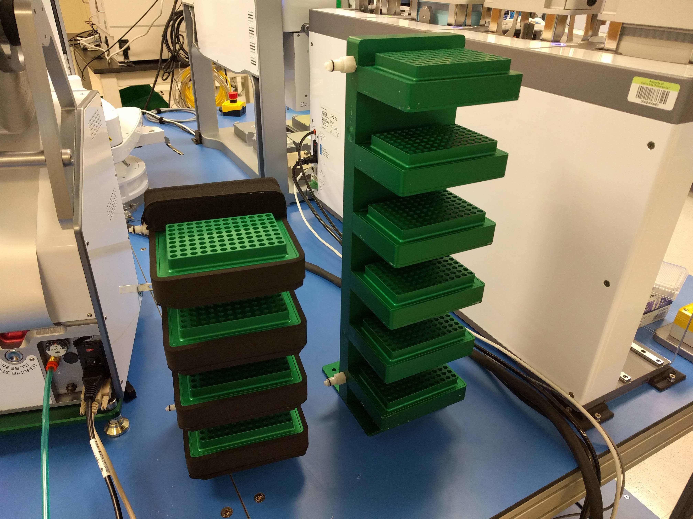
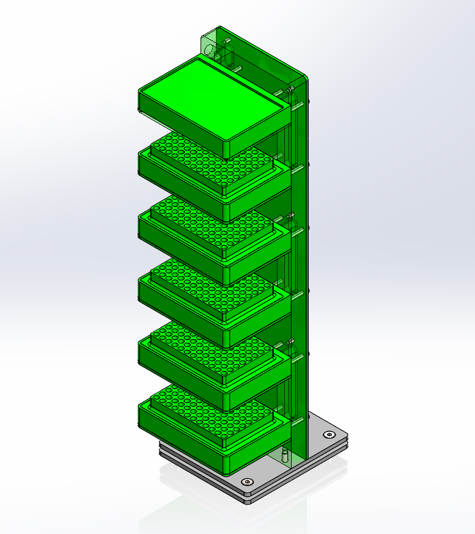

# 6 Position Cold Tower
Description:

This is a 6-shelf cold tower that can be bolted into a robotic integration.  We were using an Agilent DDR arm, but any arm should be able to reach in and pick/place plates from the nests.  Condensation can be a real issue with these - it's best to put dummy plates on any of the unused location, or any location where the plate will be removed for a long time.  

Assembly:
- Assemble and seal each shelf block first
- Screw on the cover plate, make sure to start from the middle of the block and then move to the outer screws, tighten them slowly and evenly 
- Wait 24hrs for the sealant to cure before testing - don't assemble the rest until you're sure there are no leaks, you might have to separate the block and cover and reseal it if there are leaks
- Once the main body is sealed and there are no leaks, assemble the rest of block cover and pedistal parts, then wrap the block in the 3mm thick foam strip
- The COLD-TOWER-MAIN-BASE-EXTENSION-INSULATION-v001.pdf is a laser cutting template for the closed-cell foam between the two base plates, this can also be made by hand with a sharp knife

Possible Improvements:
- Foam covers for un-used nests would be helpful to prevent condensation
- Some sort of drain on the adapters and nests might also help
