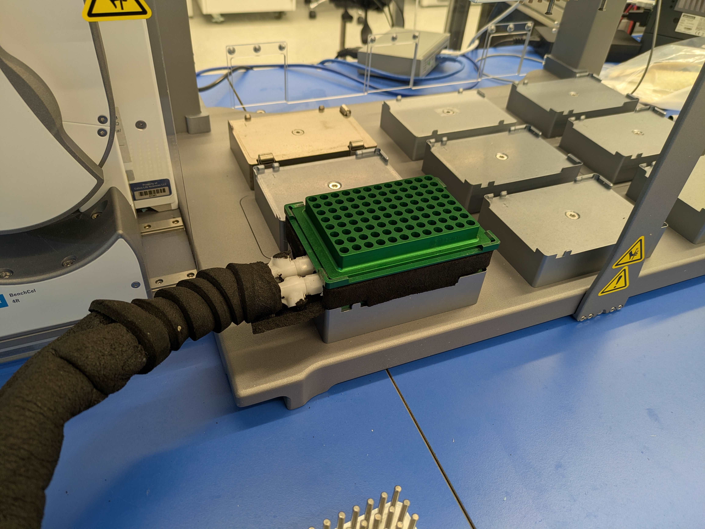
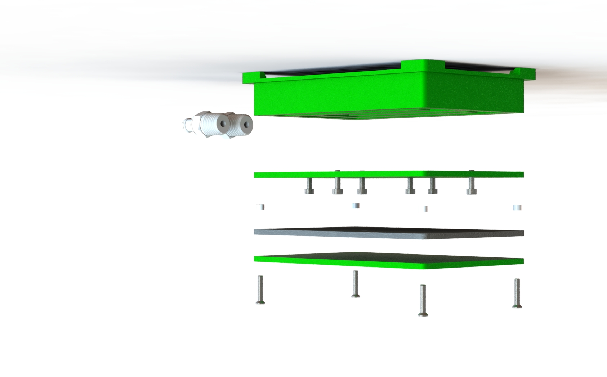
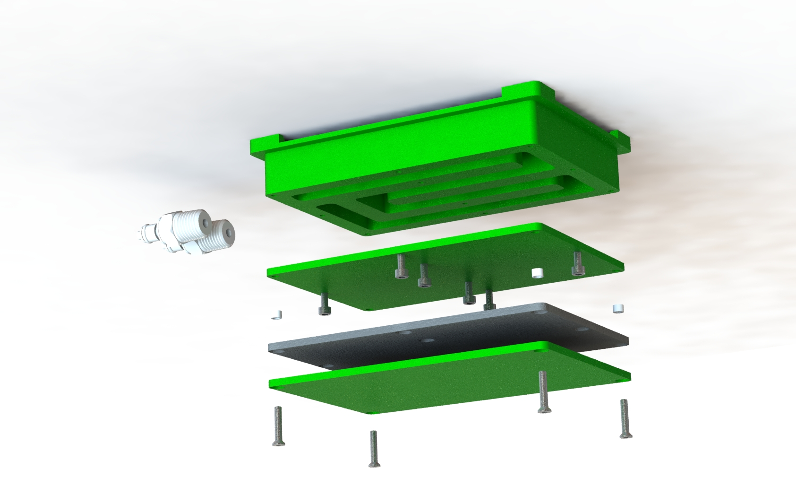

# Bravo Plate Cold Block
Description:
This is a single position chiller originally developed by Travis Lee.  It fits onto a Bravo plate pad and we made several for molecular biology workflows like RNAseq library prep for NGS.  

We've daisy-chained multiple blocks off of the same chiller line in the past and it has worked well.  

Assembly:
- Apply sealant to the edges of the channel in the body block
- Screw on the cover plate, make sure to start from the middle of the block and then move to the outer screws, tighten them slowly and evenly 
- Wait 24hrs for the sealant to cure before testing - don't assemble the rest until you're sure there are no leaks, you might have to separate the block and cover and reseal it if there are leaks
- Once the main body is sealed and there are no leaks, wrap the block in the 6mm thick foam strip
- Cut off sections of the foam strip for mounting into the Bravo plate pad

Possible Improvements:
- Adding a chamfer around the edges of the channel in the CHILLED-POSITION-BODY would probably make the sealant more effective and less leak-prone while assembling