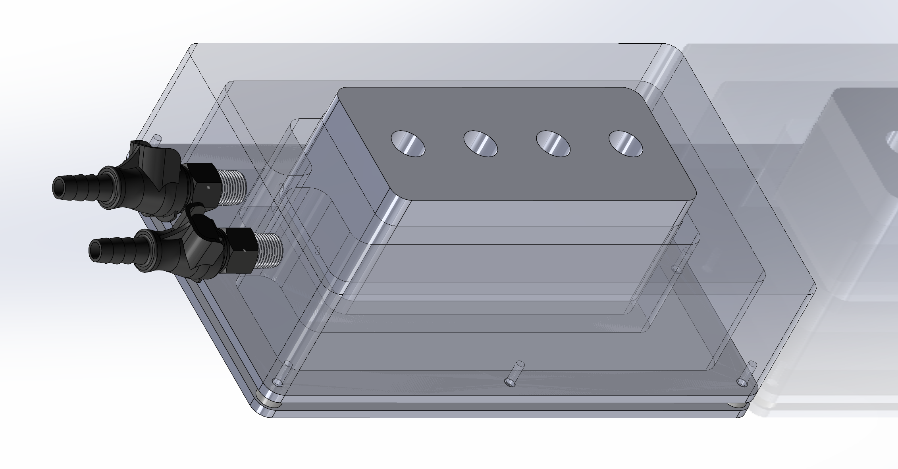
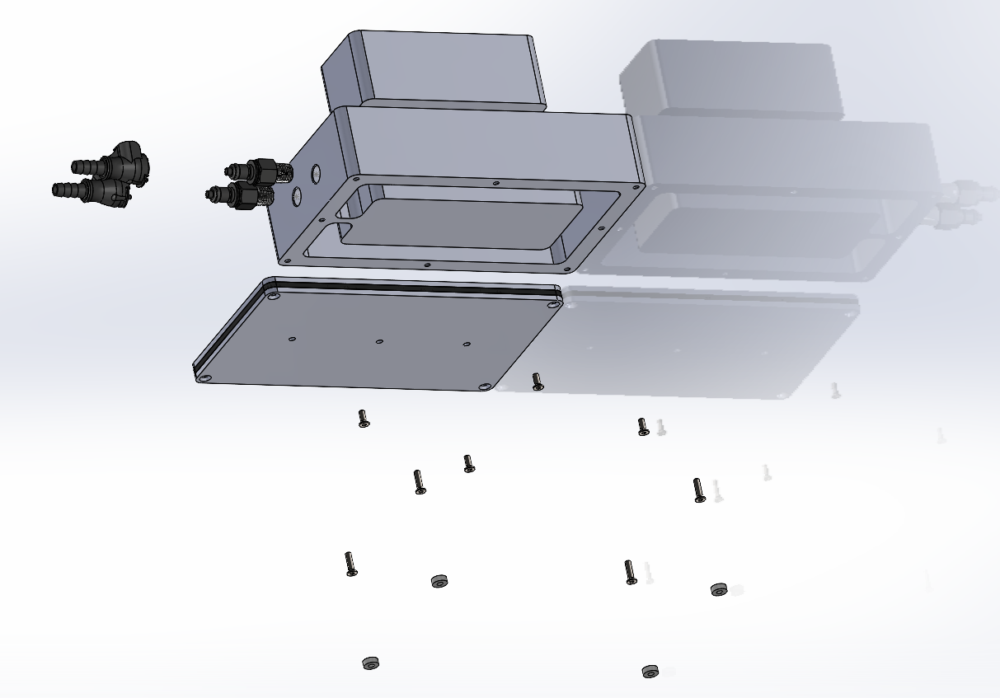

# Reagent Tube Chiller
Description:

This is a chiller block for tubes - we stored NGS reagents that were being dispensed by a Formulatrix Mantis.  It would be easy to create new "sub-blocks" for different tube types.  We would also keep the sub-blocks in ice buckets while preparing reagents, then drop them into place for the automated run.  

  

  

Assembly:
- Assemble the main block body first, applying sealant to the space between the block and cover
- Screw on the cover plate, make sure to start from the middle of the block and then move to the outer screws, tighten them slowly and evenly 
- Wait 24hrs for the sealant to cure before testing - don't assemble the rest until you're sure there are no leaks, you might have to separate the block and cover and reseal it if there are leaks
- Once the main body is sealed and there are no leaks, assemble the rest of block cover and pedistal parts, then wrap the block in the 3mm thick foam strip
- The UNIVERSAL-MAIN-BASE_INSULATION-v001.pdf is a laser cutting template for the closed-cell foam between the two base plates, this can also be made by hand with a sharp knife

  

  

Possible Improvements:
- A chamfered edge between the main block and the cover would improve the silicone gasket
- Many other sub-blocks could be designed for other tube types