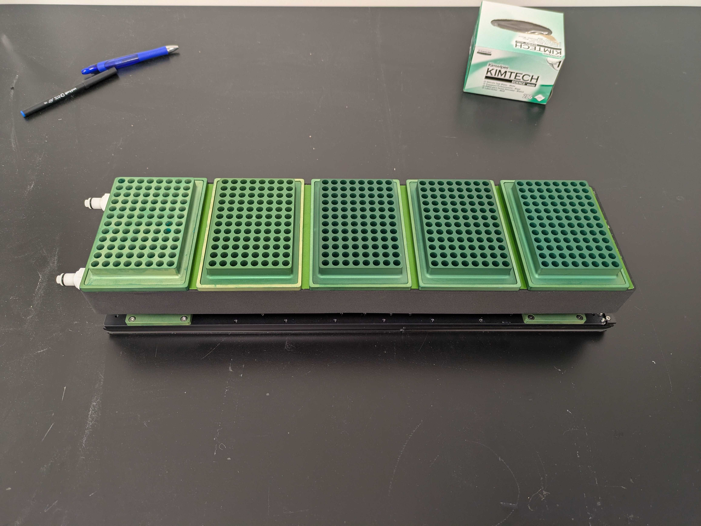
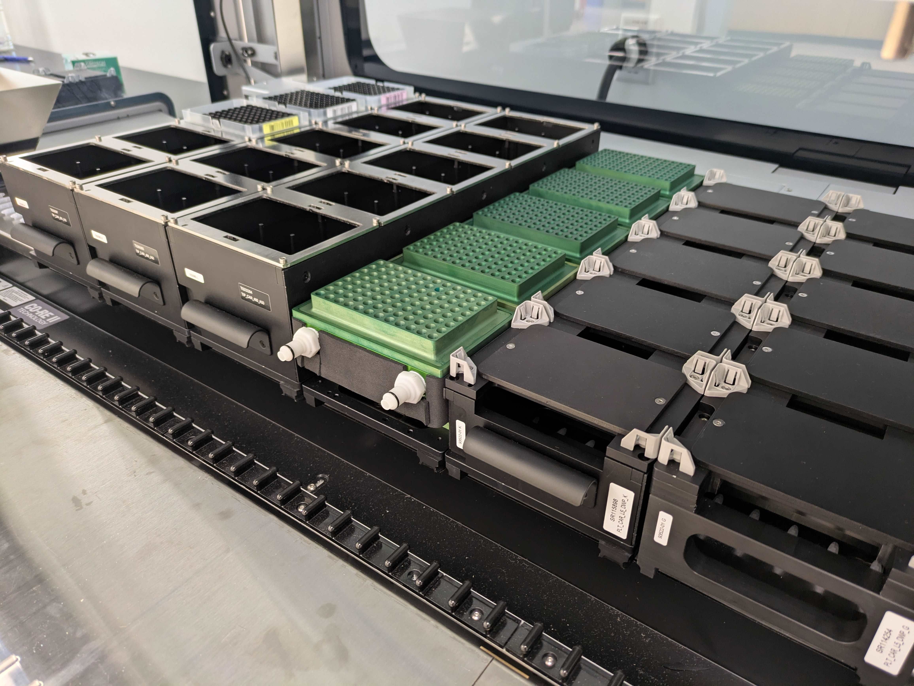

# Vantage Cold Carrier
Description:
This is a 5-position chiller that fits onto a Hamilton Vantage deck.  It uses the base from a regular plate carrier (PLT_CAR_L5_MTP_M) that we sacrificed.  It should fit onto an of the STARs as well.  The height of the plate positions is pretty close to the standard plate carrier, but the X,Y coordinates are different, so it has to be taught separately.  

Assembly:
- Apply sealant to the edges of the channel in the body block
- Screw on the cover plate, make sure to start from the middle of the block and then move to the outer screws, tighten them slowly and evenly 
- Wait 24hrs for the sealant to cure before testing - don't assemble the rest until you're sure there are no leaks, you might have to separate the block and cover and reseal it if there are leaks
- Once the main body is sealed and there are no leaks, assemble the rest of block cover and pedistal parts, then wrap the block in the 3mm thick foam strip

Possible Improvements:
- None, this one is perfect 
